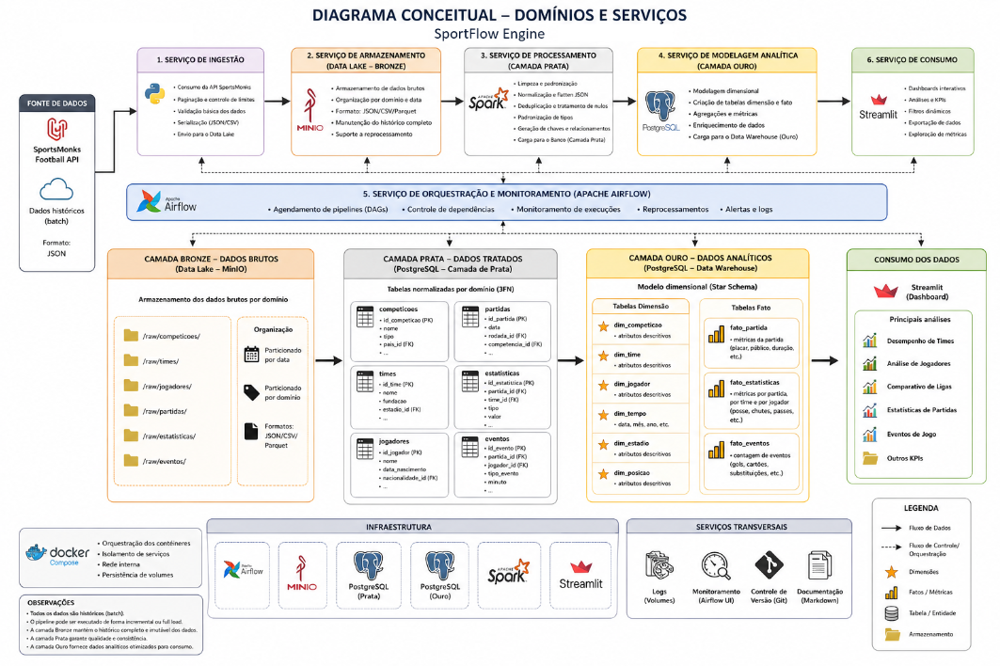
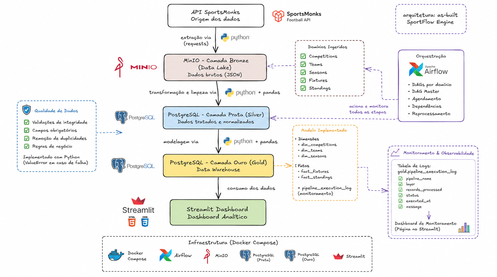

# ⚽ SportFlow Engine

## Plataforma de Engenharia de Dados para Análise de Dados Esportivos

---

Repositório destinado para os arquivos da primeira parte do projeto - Parte 1: https://github.com/LucasgPetry/Data_Engineering_SportFlow 

# Visão Geral

O SportFlow Engine é uma plataforma de Engenharia de Dados desenvolvida para coletar, armazenar, transformar, modelar e disponibilizar dados esportivos para análise.

O projeto foi construído utilizando uma arquitetura inspirada no conceito Lakehouse, organizada em três camadas principais:

* Bronze (Data Lake)
* Silver (Dados Tratados)
* Gold (Data Warehouse)

Os dados são obtidos da API SportsMonks e processados através de pipelines automatizados utilizando Apache Airflow, sendo posteriormente disponibilizados para análise através de um dashboard desenvolvido em Streamlit.

Este projeto corresponde à implementação prática da arquitetura planejada na primeira etapa do trabalho da disciplina de Engenharia de Dados.

---

# Objetivos do Projeto

O projeto tem como objetivo demonstrar a construção de uma plataforma moderna de dados contemplando:

* Ingestão de dados externos
* Armazenamento histórico
* Transformação e tratamento de dados
* Modelagem analítica
* Orquestração automatizada
* Monitoramento de pipelines
* Governança de dados
* Qualidade de dados
* Consumo analítico

---

# Arquitetura Planejada (Parte 1)



---

# Arquitetura Implementada (As-Built)



A arquitetura implementada utiliza:

* SportsMonks API
* MinIO
* PostgreSQL
* Apache Airflow
* Streamlit
* Docker Compose

---

# Comparação entre Planejamento e Implementação

Durante a implementação prática foram necessárias algumas adaptações em relação à arquitetura originalmente proposta.

## Componentes Mantidos

* SportsMonks API
* MinIO
* PostgreSQL
* Apache Airflow
* Streamlit
* Docker Compose
* Arquitetura Bronze / Silver / Gold

## Componentes Alterados

### Processamento

#### Planejado

Apache Spark

#### Implementado

Python + Pandas

#### Justificativa

O volume de dados disponibilizado pela API utilizada mostrou-se reduzido para justificar a complexidade operacional de um ambiente Spark.

Pandas apresentou desempenho suficiente para o escopo acadêmico do projeto.

---

### Domínios

#### Planejado

* Competitions
* Teams
* Players
* Fixtures
* Events
* Statistics

#### Implementado

* Competitions
* Teams
* Seasons
* Fixtures
* Standings

#### Justificativa

Limitações de disponibilidade dos dados e do plano utilizado na API direcionaram a priorização dos domínios efetivamente implementados.

---

### Modelagem Analítica

#### Planejado

Modelo dimensional mais abrangente com múltiplas tabelas fato e dimensão.

#### Implementado

Dimensões:

* dim_competitions
* dim_teams
* dim_seasons

Fatos:

* fact_fixtures
* fact_standings

---

# Tecnologias Utilizadas

| Tecnologia      | Finalidade                    |
| --------------- | ----------------------------- |
| Python          | Desenvolvimento dos pipelines |
| Pandas          | Transformações de dados       |
| PostgreSQL      | Camadas Silver e Gold         |
| MinIO           | Data Lake Bronze              |
| Apache Airflow  | Orquestração                  |
| Streamlit       | Dashboard Analítico           |
| Docker Compose  | Infraestrutura                |
| SportsMonks API | Fonte de Dados                |
| UV              | Gerenciamento de dependências |

---

# Estrutura do Projeto

```text
sportflow-engine/

├── airflow/
│   ├── dags/
│   ├── logs/
│   └── plugins/
│
├── data/
│
├── docker/
│
├── docs/
│   ├── data_catalog.md
│   └── diagrams/
│
├── src/
│   ├── bronze/
│   ├── silver/
│   ├── gold/
│   ├── common/
│   │   ├── quality/
│   │   └── monitoring.py
│   └── config/
│
├── streamlit/
│
├── docker-compose.yml
├── pyproject.toml
├── uv.lock
└── README.md
```

---

# Como Executar

## Pré-requisitos

* Docker Desktop
* Python 3.11+
* UV

## Clonar Repositório

```bash
git clone <repositorio>
cd sportflow-engine
```

## Instalar Dependências

```bash
uv sync
```

## Configurar Variáveis de Ambiente

Criar arquivo `.env`.

Exemplo:

```env
POSTGRES_DB=sportflow_dw
POSTGRES_USER=sportflow
POSTGRES_PASSWORD=********

MINIO_ROOT_USER=minioadmin
MINIO_ROOT_PASSWORD=********

SPORTSMONKS_API_TOKEN=********
```

## Subir Infraestrutura

```bash
docker compose up -d
```

## Serviços Disponíveis

| Serviço       | URL                   |
| ------------- | --------------------- |
| Airflow       | http://localhost:8080 |
| MinIO Console | http://localhost:9001 |
| Streamlit     | http://localhost:8501 |

---

# Domínios Implementados

| Domínio      | Bronze | Silver | Gold |
| ------------ | ------ | ------ | ---- |
| Competitions | ✓      | ✓      | ✓    |
| Teams        | ✓      | ✓      | ✓    |
| Seasons      | ✓      | ✓      | ✓    |
| Fixtures     | ✓      | ✓      | ✓    |
| Standings    | ✓      | ✓      | ✓    |

---

# Camada Bronze

## Objetivo

Armazenar dados brutos obtidos diretamente da API SportsMonks.

## Tecnologia

* MinIO
* JSON

## Características

* Dados históricos preservados
* Organização por domínio
* Particionamento por data
* Reprocessamento possível

---

# Camada Silver

## Objetivo

Realizar limpeza, validação e padronização dos dados.

## Tecnologia

* Python
* Pandas
* PostgreSQL

## Processamentos Realizados

* Remoção de duplicidades
* Tratamento de nulos
* Padronização de colunas
* Validações de integridade
* Preparação para análise

---

# Camada Gold

## Objetivo

Disponibilizar os dados para consumo analítico.

## Dimensões

* dim_competitions
* dim_teams
* dim_seasons

## Fatos

* fact_fixtures
* fact_standings

## Monitoramento

* pipeline_execution_log

---

# Orquestração

## Apache Airflow

O Airflow é responsável pela automação dos pipelines.

### Funcionalidades

* DAGs por domínio
* DAG Master
* Controle de dependências
* Reprocessamento
* Agendamento
* Monitoramento operacional

---

# Dashboard Analítico

O dashboard foi desenvolvido utilizando Streamlit.

## Funcionalidades

* Overview
* Classificação
* Partidas
* Times
* Competições
* Temporadas
* Monitoramento

## Recursos

* KPIs
* Filtros dinâmicos
* Gráficos interativos
* Atualização manual
* Observabilidade dos pipelines

---

# Qualidade de Dados

Foi implementada uma camada de validação na Silver.

## Regras Implementadas

### Competitions

* competition_id obrigatório
* competition_name obrigatório
* sem duplicidades

### Teams

* team_id obrigatório
* team_name obrigatório
* sem duplicidades

### Fixtures

* fixture_id obrigatório
* season_id obrigatório

### Standings

* participant_id obrigatório
* points >= 0
* position > 0

Em caso de falha o pipeline é interrompido através da geração de exceções.

---

# Governança de Dados

## Organização por Camadas

* Bronze
* Silver
* Gold

## Catálogo de Dados

Arquivo:

```text
docs/data_catalog.md
```

O catálogo documenta:

* origem dos dados
* granularidade
* finalidade
* atributos principais
* tabelas fato
* tabelas dimensão

---

# Segurança

## Variáveis de Ambiente

Credenciais foram externalizadas para arquivo `.env`.

Exemplos:

* SportsMonks API Token
* PostgreSQL User
* PostgreSQL Password
* MinIO Credentials

## Controle de Versão

O arquivo `.env` encontra-se listado no `.gitignore`.

## Isolamento

Toda a infraestrutura é executada em containers Docker independentes.

---

# Monitoramento e Observabilidade

Foi implementada uma camada de monitoramento operacional.

## Tabela de Logs

```text
gold.pipeline_execution_log
```

Campos monitorados:

* pipeline_name
* layer
* records_processed
* status
* executed_at
* message

## Dashboard de Monitoramento

O Streamlit disponibiliza uma página específica para acompanhamento das execuções dos pipelines.

---

# Resultados Obtidos

Ao final da implementação foi possível:

* Construir pipeline ponta a ponta
* Automatizar execuções através do Airflow
* Implementar Data Lake e Data Warehouse
* Implementar monitoramento operacional
* Implementar governança de dados
* Implementar validações de qualidade
* Disponibilizar dashboard analítico

## Volume de Dados Processados

| Domínio      | Registros |
| ------------ | --------: |
| Competitions |         4 |
| Teams        |        49 |
| Seasons      |        25 |
| Fixtures     |        49 |
| Standings    |       428 |

**Total processado:** 555 registros.

---

# Limitações do Projeto

## Limitações da API

* Restrições do plano utilizado
* Domínios não disponíveis
* Baixo volume em determinados endpoints

## Limitações de Infraestrutura

* Airflow executado em modo standalone
* Ambiente executado localmente
* PostgreSQL compartilhado entre Silver e Gold

## Limitações Técnicas

* Ausência de processamento distribuído
* Ausência de autenticação avançada
* Ausência de CI/CD

---

# Trabalhos Futuros

Possíveis evoluções:

* Inclusão dos domínios Players, Events e Statistics
* Utilização de Apache Spark
* Expansão do modelo dimensional
* Implementação de CI/CD
* Implementação de autenticação
* Monitoramento avançado com alertas
* Expansão dos dashboards analíticos

---

# Conclusão

O SportFlow Engine permitiu a implementação prática de uma arquitetura moderna de Engenharia de Dados contemplando ingestão, armazenamento, transformação, modelagem analítica, governança, monitoramento e consumo dos dados.

O projeto demonstrou a aplicação dos conceitos estudados ao longo da disciplina e a construção de uma solução funcional capaz de transformar dados esportivos em informações analíticas para suporte à tomada de decisão.
